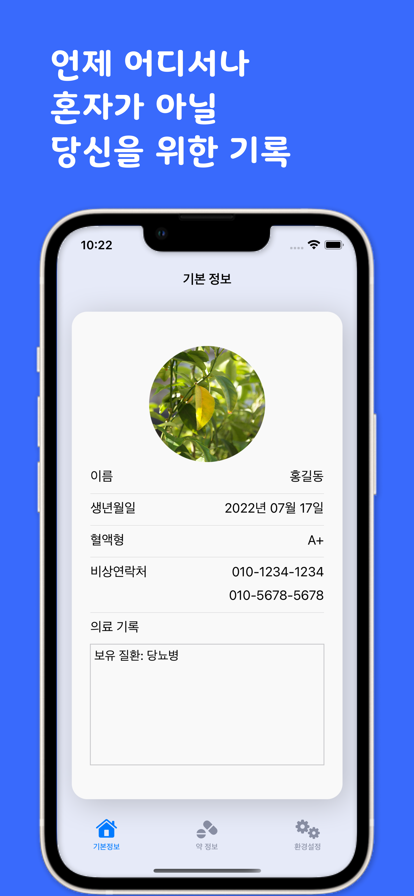
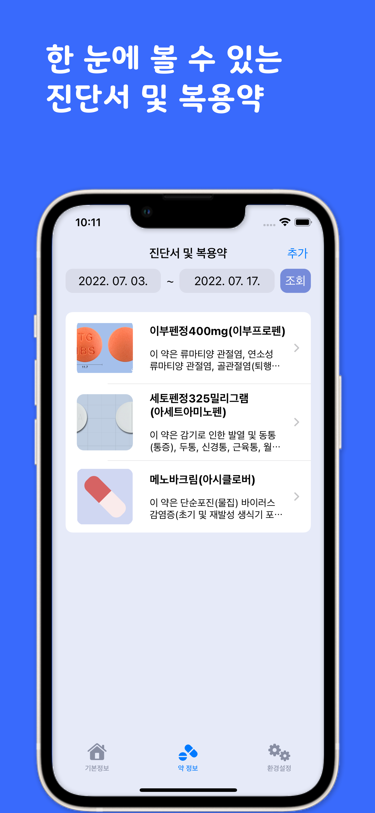
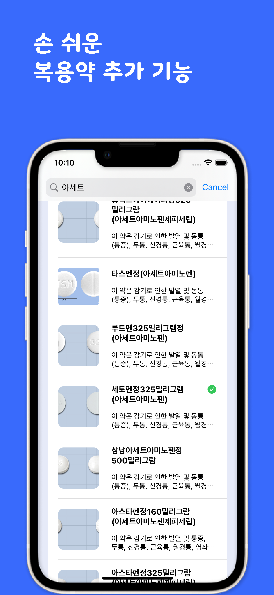

# :iphone: Jikyeojulge
Eddy-Meenu의 사이드 프로젝트 레포입니다.

혼자가 아닌 당신을 위한 기록

## :people_hugging: Authors

|||
|:-:|:-:|
|[Eddy](https://www.github.com/JUNY0110)|[Meenu](https://github.com/taek0622)|

## :framed_picture: Demo

Insert gif or link to demo

## :fireworks: Screenshots

## :sparkles: Skills & Tech Stack

- SwiftUI
- CoreData
- URLSession
- Combine (Codable)
- WidgetKit

## Used Data

- [식품의약품안전처_의약품개요정보(e약은요)](https://www.data.go.kr/data/15075057/openapi.do)

## ✔️ History
- 2022.06.26. GIT REPO CREATED

## 🧩 ETC

[Convention](./Convention.md)
